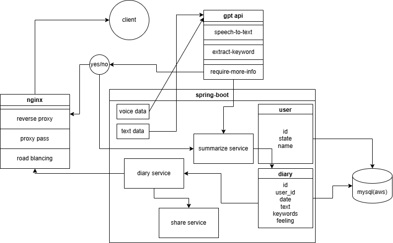

# **Voice Recognition AI Diary App**

## **Overview**
The Voice Recognition AI Diary App is a cutting-edge application that allows users to effortlessly record their daily thoughts and experiences using voice input. By leveraging advanced AI technologies, the app transcribes voice recordings into text and summarizes key points, making it a perfect companion for journaling, note-taking, and self-reflection.

## **Features**
- **Voice-to-Text Conversion**: Seamlessly convert your voice recordings into accurate text using AI-powered speech recognition.
- **AI-Powered Summarization**: Automatically generate concise summaries of your diary entries for quick reference.
- **Secure and Private**: Your data is encrypted and stored securely to ensure privacy and confidentiality.
- **User-Friendly Interface**: A clean and intuitive design for an effortless journaling experience.

## **How It Works**
1. Record your voice: Speak your thoughts, ideas, or reflections directly into the app.
2. AI processing: The app converts your voice into text using advanced speech recognition technology.
3. Summarization: The app extracts key points and provides a summary of your entry.
4. Save and review: Store your entries securely and revisit them anytime.

## **Who Is It For?**
This app is ideal for:
- People who prefer speaking over typing.
- Individuals looking to organize their thoughts and ideas efficiently.
- Anyone who wants a modern, AI-powered journaling experience.

## **Why Use This App?**
With the Voice Recognition AI Diary App, you can focus on expressing yourself without worrying about typing or organizing your entries. Whether you're a busy professional, a student, or just someone who loves to journal, this app empowers you to capture your thoughts effortlessly.

---
